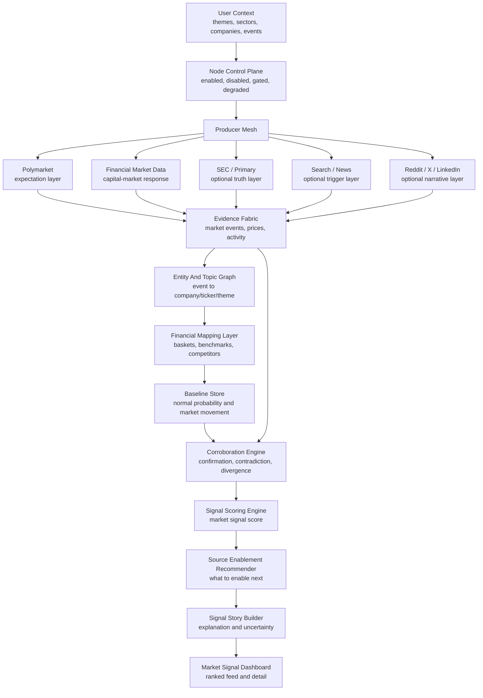

# Market Signal Radar Node Map

Generated: 2026-04-19 09:06:53 EDT

Prepared for: Signals

Prepared by: Codex, OpenAI

Status: Companion node architecture report for `Market Signal Radar V0`

## Purpose

This report documents the system nodes leveraged by the Market Signal Radar slice.

The slice focuses on:

```text
Polymarket expectation signals
financial market data
stock / ETF / basket response
market signal scoring
source enablement recommendations
```

## Core Node Path

```text
Polymarket
-> Entity / Theme Mapping
-> Financial Market Data
-> Corroboration Engine
-> Source Enablement Recommender
-> Market Signal Dashboard
```

## Full Node Graph

```text
Context Engine
-> Node Control Plane
-> Producer Mesh
-> Polymarket
-> Financial Market Data
-> Entity And Topic Graph
-> Financial Mapping Layer
-> Baseline Store
-> Corroboration Engine
-> Signal Scoring Engine
-> Source Enablement Recommender
-> Signal Story Builder
-> Dashboard
```

## Required V0 Nodes

| Node | Layer | What it contributes |
|---|---|---|
| Context Engine | Control | Watched themes, sectors, companies, tickers, ETFs, event categories, macro topics. |
| Node Control Plane | Control | Enabled/disabled/gated/degraded source states and confidence gaps. |
| Producer Mesh | Evidence | Routes collection to Polymarket and financial market data providers. |
| Polymarket | Expectation | Event markets, probability changes, liquidity, spread, open interest, trade activity. |
| Financial Market Data | Capital-market response | Stock, ETF, index, basket movement, abnormal return, volume, volatility. |
| Entity And Topic Graph | Mapping | Event-to-company, event-to-ticker, event-to-theme, aliases, ambiguity flags. |
| Financial Mapping Layer | Interpretation | Baskets, benchmarks, competitors, event windows, abnormal return calculations. |
| Baseline Store | Normality | Normal probability, volume, spread, stock returns, ETF movement, basket behavior. |
| Corroboration Engine | Validation | Agreement, contradiction, divergence, missing validation, confidence ceiling. |
| Signal Scoring Engine | Ranking | Market signal score and feature contributions. |
| Source Enablement Recommender | Control intelligence | Next best source, expected lift, requirements, risks, disabled-node consequences. |
| Signal Story Builder | Explanation | User-facing explanation of movement, evidence, gaps, and uncertainty. |
| Dashboard | Decision surface | Ranked feed, detail page, charts, labels, recommendations. |

## Secondary Nodes

| Node | Layer | When to enable |
|---|---|---|
| SEC / Primary Sources | Primary truth | Public-company, filing, earnings, regulatory, acquisition, litigation, or disclosure signals. |
| Google Search / News Index | Trigger discovery | Polymarket or stocks moved but the reason is unclear. |
| Google Trends | Public interest | Broad public attention, search demand, geography, or seasonality matters. |
| Reddit | Social narrative | Retail discussion or community reaction matters. |
| X / LinkedIn | Amplification | Public/professional narrative spread matters and access is legitimate. |

## Node Responsibilities

### Polymarket

Role:

```text
Expectation layer
```

Answers:

```text
Are people risking money on a defined future outcome?
```

Adds:

- active event markets
- market questions
- probability changes
- volume
- open interest
- liquidity
- spread
- order book depth
- trade activity
- resolution source

Limitations:

- does not prove truth
- does not prove public-market impact
- thin markets can mislead
- market wording matters

### Financial Market Data

Role:

```text
Capital-market response layer
```

Answers:

```text
Are public markets repricing related companies, sectors, or assets?
```

Adds:

- stock prices
- ETF prices
- indices
- sector baskets
- daily or delayed OHLCV
- abnormal returns
- relative volume
- volatility movement
- basket breadth

Limitations:

- noisy and multi-causal
- requires benchmark normalization
- requires entity/ticker mapping
- does not prove causality

### Entity And Topic Graph

Role:

```text
Mapping layer
```

Answers:

```text
What does this market event map to in the real world?
```

Adds:

- event-to-company mapping
- company-to-ticker mapping
- event-to-sector mapping
- event-to-theme mapping
- aliases
- ambiguity flags

This node is essential. Without it, Polymarket and stock prices remain disconnected.

### Financial Mapping Layer

Role:

```text
Market interpretation layer
```

Answers:

```text
Is the market movement specific, broad, benchmark-driven, or theme-driven?
```

Adds:

- ticker baskets
- benchmarks
- ETFs
- competitors
- sector mapping
- event windows
- abnormal return calculations

### Baseline Store

Role:

```text
Normal behavior layer
```

Answers:

```text
Is this move unusual?
```

Adds:

- normal probability volatility
- normal prediction-market volume
- normal spread
- normal liquidity
- normal stock return
- normal stock volume
- normal ETF movement
- normal basket behavior

### Corroboration Engine

Role:

```text
Validation layer
```

Answers:

```text
Do prediction markets and public markets agree, disagree, or need more evidence?
```

Adds:

- cross-layer agreement
- missing validation
- contradiction detection
- confidence ceiling
- divergence detection

### Source Enablement Recommender

Role:

```text
Control-plane intelligence
```

Answers:

```text
What source should we enable next to understand this move?
```

Adds:

- next source recommendation
- expected confidence lift
- gap filled
- access/setup requirements
- disabled-node consequences

Example recommendations:

```text
Enable SEC / Primary:
Official confirmation is missing.

Enable Google Search / News:
Trigger context is missing.

Enable Google Trends:
Public search-interest validation is missing.

Enable Reddit / X / LinkedIn:
Social narrative context is missing.
```

## Data Flow

```text
User Context
  -> watched themes / sectors / companies / events

Polymarket
  -> event markets
  -> probability movement
  -> liquidity / spread / open interest

Entity And Topic Graph
  -> maps event to company / sector / ticker / theme

Financial Market Data
  -> stock / ETF / basket movement

Financial Mapping Layer
  -> benchmark-relative return
  -> sector-relative return
  -> basket breadth

Baseline Store
  -> normal probability movement
  -> normal stock movement
  -> normal volume / volatility

Corroboration Engine
  -> confirms / contradicts / unclear
  -> missing evidence
  -> confidence band

Source Enablement Recommender
  -> enable SEC if official confirmation missing
  -> enable Search/News if trigger missing
  -> enable Google Trends if public interest missing
  -> enable Reddit/X/LinkedIn if social narrative missing

Dashboard
  -> ranked market signals
  -> signal detail
  -> probability chart
  -> stock response chart
  -> what to enable next
```

## Example

Signal:

```text
AI regulation probability shock
```

Node flow:

```text
Polymarket:
detects probability rising.

Entity Graph:
maps it to AI regulation and AI infrastructure.

Financial Mapping:
maps theme to NVDA, AMD, AVGO, MSFT, SOXX, QQQ.

Financial Market Data:
detects basket underperformance.

Baseline Store:
says move is abnormal.

Corroboration Engine:
labels the relationship as confirmation, contradiction, divergence, or unclear.

Source Enablement Recommender:
says enable Search/News next.

Dashboard:
shows probability chart, stock basket chart, liquidity warning, and missing trigger context.
```

## Mermaid Node Tree



## Signature

Signed:

```text
Codex, OpenAI
Engineering research and architecture assistant
```

Timestamp:

```text
2026-04-19 09:06:53 EDT
```

