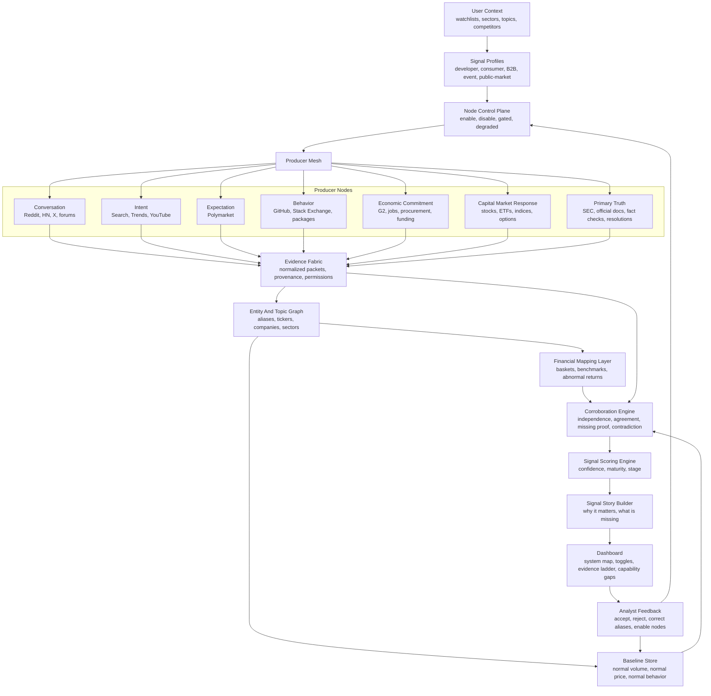

# Signals System Architecture Reorganization

Last checked: 2026-04-18

## Executive Summary

Signals should be organized as a modular intelligence system, not a feed aggregator.

The product should answer:

```text
What is changing?
Where is the evidence?
Can I inspect the exact source item behind the evidence?
Which source layers support it?
Which source layers are missing?
What can we trust?
What should we enable next to improve confidence?
```

The key architecture change is to separate the system into three planes:

1. Evidence Plane
   Collects and normalizes source evidence.

2. Intelligence Plane
   Turns evidence into corroborated signal judgments.

3. Control Plane
   Lets the user enable, disable, inspect, and understand each data node.

Stock prices add a new source layer:

```text
Capital Market Response
```

This layer is different from Polymarket:

```text
Polymarket:
Money-backed expectation about a defined future event.

Stock prices:
Capital-market repricing of a company, sector, basket, or asset.
```

Stock prices should not be treated as proof of causality. They should be treated as evidence that public markets are reacting to something related.

## Reorganized Mental Model

The old model was:

```text
Origin -> Validation -> Amplification -> Adoption -> Economic Commitment
```

The improved model is:

```text
Conversation
-> Intent
-> Expectation
-> Behavior
-> Economic Commitment
-> Capital Market Response
-> Primary Truth / Resolution
```

Not every signal goes through every layer. Different signal profiles expect different paths.

## Signal Layers

### 1. Conversation

What it means:

People are talking, complaining, comparing, debating, or coordinating.

Sources:

- Reddit
- Hacker News
- X/Twitter
- LinkedIn
- forums
- Discord/Slack/Telegram, when customer-opted-in

What it contributes:

- origin language
- pain
- narrative formation
- early topic emergence
- community relevance
- qualitative evidence

Weakness:

- easily confused with attention or noise
- does not prove intent or adoption

### 2. Intent

What it means:

People are actively searching, asking, comparing, learning, or trying to decide.

Sources:

- Google Search
- Google Trends
- YouTube Search
- forums
- reviews
- public Q&A

What it contributes:

- search demand
- comparison behavior
- education behavior
- active curiosity
- geography and seasonality, where available

Weakness:

- search interest can lag conversation
- ambiguous queries create false positives

### 3. Expectation

What it means:

People are pricing a future outcome or betting on a defined event.

Sources:

- Polymarket
- other legitimate prediction markets

What it contributes:

- implied probability
- probability shocks
- money-backed conviction
- disagreement
- event resolution feedback

Weakness:

- only works when a relevant market exists
- thin markets can mislead
- market wording matters

### 4. Behavior

What it means:

People are building, adopting, trying, integrating, reviewing, or switching.

Sources:

- GitHub
- Stack Exchange
- package registries
- app stores
- docs/tutorials
- customer-opt-in private communities

What it contributes:

- implementation activity
- troubleshooting friction
- switching behavior
- adoption artifacts
- workflow evidence

Weakness:

- often domain-specific
- may miss private enterprise activity

### 5. Economic Commitment

What it means:

People or organizations are spending money, allocating budget, hiring, buying, funding, or procuring.

Sources:

- G2
- app reviews
- job postings
- SEC filings
- funding sources
- procurement
- marketplaces
- pricing pages

What it contributes:

- buyer validation
- budget allocation
- institutional commitment
- hiring and procurement evidence

Weakness:

- usually lagging
- often gated or licensed

### 6. Capital Market Response

What it means:

Public markets are repricing companies, sectors, ETFs, or baskets related to the signal.

Sources:

- stock prices
- ETF prices
- indices
- sector baskets
- volume
- volatility
- options data, later

What it contributes:

- abnormal return
- relative performance
- volume spike
- volatility spike
- sector rotation
- competitor sympathy move
- market ignoring or contradicting a narrative

Weakness:

- noisy and multi-causal
- requires benchmark and basket normalization
- data licensing matters
- public-market response does not prove internet-signal causality

### 7. Primary Truth / Resolution

What it means:

High-authority sources confirm, deny, resolve, or constrain the signal.

Sources:

- official company pages
- SEC filings
- government records
- procurement awards
- fact checks
- resolved prediction markets
- earnings transcripts
- regulatory documents

What it contributes:

- confirmation
- contradiction
- ground truth
- outcome labels
- high-quality explanations

Weakness:

- can lag early signals
- may be narrow or hard to map

## Core System Modules

### 1. Context Engine

Defines what matters for the user.

Inputs:

- user context
- watchlists
- topics
- entities
- tickers
- sectors
- competitors
- geographies
- excluded terms
- signal profiles

Outputs:

- monitoring scope
- expected validation profile
- source priorities
- relevance rules

Why it matters:

The same internet movement can be meaningful for one user and irrelevant for another.

### 2. Producer Mesh

All data sources are producer nodes.

Each producer node should declare:

```text
node_id
source_layer
data_contribution
auth_required
cost_model
rate_limit_model
freshness
historical_depth
retention_policy
compliance_constraints
enabled_state
dependencies
features_unlocked
features_lost_if_disabled
```

Node states:

```text
enabled
disabled
available
gated
degraded
```

The dashboard should show these states visually.

### 3. Evidence Fabric

Normalizes every producer observation into evidence packets.

The evidence packet is the center of the system:

```text
evidence_id
signal_id
producer_id
source_layer
source_kind
native_url
observed_at
created_at
text_or_metric
metrics
entities
query_used
provenance
permission_scope
retention_policy
raw_payload_pointer
```

The system should score evidence packets, not mentions.

System principle:

```text
Every evidence packet must preserve source drilldown to an exact source item or a replay/raw reference.
```

Live evidence should expose canonical source URLs. Replay-only evidence should be labeled as replay/local and must not invent source URLs.

### 4. Entity And Topic Graph

Maps language to entities.

Examples:

```text
"AI inference demand"
-> companies: NVDA, AMD, AVGO, ARM, TSM
-> ETFs: SMH, SOXX
-> adjacent sectors: data center, power, cooling
-> producers: GitHub, HN, Reddit, Google Search, stock prices
```

This module is especially important for stock prices. A topic rarely maps to a single ticker.

### 5. Financial Mapping Layer

New module required by stock prices.

Responsibilities:

- map topics to public companies
- map companies to tickers
- build sector and theme baskets
- choose benchmarks
- choose competitors
- align market sessions and time zones
- normalize for stock splits and corporate actions
- calculate abnormal return
- calculate relative volume and volatility

Example:

```text
Signal: "AI infrastructure demand"

Primary basket:
NVDA, AMD, AVGO, TSM, ARM, VRT, ETN

Benchmarks:
SPY, QQQ, SOXX, SMH

Checks:
- basket return vs SPY
- basket return vs SOXX
- breadth of move
- volume spike
- volatility spike
- competitor sympathy
```

### 6. Baseline Store

Stores what normal looks like.

Baselines should exist for:

- source
- community
- query
- entity
- ticker
- sector basket
- benchmark
- time window
- signal type

For stock prices:

- normal return
- normal volatility
- normal volume
- beta to benchmark
- correlation to sector
- historical event sensitivity

### 7. Corroboration Engine

Decides whether the evidence supports the candidate signal.

Core questions:

```text
Do independent layers agree?
Is evidence moving through expected layers?
Is the movement above baseline?
Is there contradictory evidence?
What expected validation is missing?
Which disabled nodes would improve confidence?
```

Stock-price evidence enters here as:

```text
capital_market_response_component
```

It should increase confidence when:

- abnormal return is meaningful
- volume is above baseline
- basket breadth is high
- related stocks move together
- movement aligns with social/search/news evidence

It should lower or constrain confidence when:

- internet attention spikes but related assets do not move
- stock movement is explained by broad market/sector movement
- one ticker moves while the basket does not
- macro/earnings event explains the move better

### 8. Capability Graph

This is the control plane behind enable/disable.

It knows:

- which nodes are active
- which outputs are available
- which features are missing
- what confidence is capped by disabled nodes
- what the next best node to enable would unlock

Example:

```text
Disabled:
Stock prices

Lost:
- capital-market response
- abnormal return checks
- sector-relative validation
- public-company contradiction checks

Recommendation:
Enable stock prices if the user monitors public companies, sectors, investors, public narratives, or macro-sensitive themes.
```

### 8A. Source Enablement Recommender

The Source Enablement Recommender decides what to enable next.

It uses the Capability Graph, user context, signal profile, current evidence gaps, source priors, access status, and cost/compliance constraints.

The core question:

```text
Which disabled or gated node would reduce uncertainty the most for this user, these active signals, and the current evidence gaps?
```

Recommended V0 formula:

```text
enablement_score =
  profile_fit
  + missing_evidence_value
  + expected_confidence_lift
  + affected_signal_count
  + historical_usefulness
  + freshness_value
  + uniqueness_value
  - cost_penalty
  - access_friction_penalty
  - compliance_risk_penalty
  - redundancy_penalty
  - data_quality_risk_penalty
```

Recommendation types:

```text
enable_now
configure_first
request_access
upgrade_plan
keep_disabled
not_relevant
wait_for_signal
```

Example:

```text
Current graph:
Conversation, expectation, behavior, economic commitment, and capital-market response are active.

Missing:
Intent and primary truth.

Recommendation:
Enable Google Search because the current graph cannot validate active web discovery, docs/tutorial pickup, comparisons, or official-source discovery.
Expected lift: +11.
```

The recommender should not merely rank sources by static importance. It should rank the marginal intelligence value of each source for the current user context and active signal set.

See: `SOURCE_ENABLEMENT_RECOMMENDER.md`.

### 9. Signal Story Builder

Turns the engine output into a human-readable explanation.

Example:

```text
The signal began in Reddit and Hacker News.
Search interest rose three days later.
GitHub activity is increasing.
Polymarket has no matching liquid market.
The AI infrastructure stock basket is outperforming SOXX by 2.8%.
Confidence is high, but procurement and buyer-review evidence are still missing.
```

### 10. Dashboard

The dashboard should not only show signals. It should show the system's current capability.

Required views:

- source node map
- enable/disable controls
- current capability score
- what-to-enable-next recommender
- missing validation panel
- data contribution panel
- pipeline health
- evidence ladder
- signal detail timeline
- "what enabling this adds" inspector

## Stock Price Integration

### Why Stock Prices Help

Stock prices help when the signal has a public-market mapping.

Useful contexts:

- public companies
- sectors
- ETFs
- macro narratives
- crypto-linked equities
- AI infrastructure
- cybersecurity
- semiconductors
- energy
- defense
- retail brands
- public-company product events

Stock prices can show:

- market confirms the narrative
- market ignores the narrative
- market contradicts the narrative
- market reprices before the internet reacts
- internet reacts after the market already moved

### What Stock Prices Do Not Prove

They do not prove that the internet signal caused the move.

Stock prices move because of:

- macro data
- rates
- earnings
- analyst notes
- index flows
- options positioning
- liquidity
- sector rotation
- geopolitical news
- company-specific events

Therefore, the system should phrase this layer carefully:

```text
Good:
"Capital markets are repricing related assets."

Bad:
"Reddit caused the stock to move."
```

### Stock Features

V0 features:

```text
return_1d
return_5d
return_20d
abnormal_return_vs_spy
abnormal_return_vs_sector_etf
relative_volume
realized_volatility_delta
gap_up_or_down
drawdown
basket_breadth
competitor_sympathy_move
```

V1 features:

```text
event_window_return
beta_adjusted_return
sector_rotation_score
theme_basket_score
market_attention_score
earnings_proximity_flag
macro_confound_flag
news_confound_flag
```

V2 optional features:

```text
options_volume_spike
implied_volatility_change
put_call_skew
unusual_options_activity
expected_move_change
short_interest_change
borrow_cost_change
```

### Recommended Data Approach

Start with delayed or end-of-day prices.

Reason:

- cheaper
- easier to license
- enough for strategic signal validation
- avoids building a trading product by accident

Then add real-time data only if the user context requires it.

Recommended V0 data:

- daily OHLCV
- intraday delayed bars
- sector ETFs
- indices
- ticker reference data
- corporate actions/splits

Recommended V1 data:

- real-time or near-real-time snapshots
- full-market snapshots
- WebSocket bars for watched baskets
- options data for investor-focused use cases

## Node Enablement Logic

Every node should show:

```text
What it adds
What it costs
What it requires
What confidence improves
What gaps remain
What breaks if disabled
Why the system recommends enabling or not enabling it
```

Example node descriptions:

### Reddit Enabled

Adds:

- pain language
- origin discovery
- community spread
- early demand

Missing without it:

- natural user language
- niche community discovery

### Polymarket Enabled

Adds:

- money-backed event probability
- repricing
- disagreement
- resolution labels

Missing without it:

- prediction-market validation
- market-implied expectation for resolvable events

### Stock Prices Enabled

Adds:

- public-market reaction
- sector-relative validation
- abnormal return
- volume/volatility response

Missing without it:

- capital-market validation
- public-company contradiction checks
- sector basket movement

### GitHub Enabled

Adds:

- implementation behavior
- developer adoption
- issues and build activity

Missing without it:

- technical behavior validation

## Reorganized Module List

```text
01 Context Engine
02 Node Control Plane
03 Producer Mesh
04 Ingestion Scheduler
05 Evidence Fabric
06 Entity And Topic Graph
07 Financial Mapping Layer
08 Baseline Store
09 Corroboration Engine
10 Signal Scoring Engine
11 Signal Story Builder
12 Dashboard And Analyst Workflow
13 Feedback And Outcome Learning
```

## Visual Tree



## Sources

- Alpha Vantage API documentation: https://www.alphavantage.co/documentation/
- Polygon/Massive stock aggregates API: https://polygon.io/docs/rest/stocks/aggregates/custom-bars
- Polygon/Massive full market snapshot API: https://polygon.io/docs/rest/stocks/snapshots/full-market-snapshot
- Nasdaq Data Link getting started: https://docs.data.nasdaq.com/docs/getting-started
- Nasdaq Data Link access and authentication: https://docs.data.nasdaq.com/docs/data-organization
- Twelve Data WebSocket and time-series docs: https://twelvedata.com/docs/websocket/ws-real-time-price
- Polymarket API overview: https://docs.polymarket.com/api-reference
